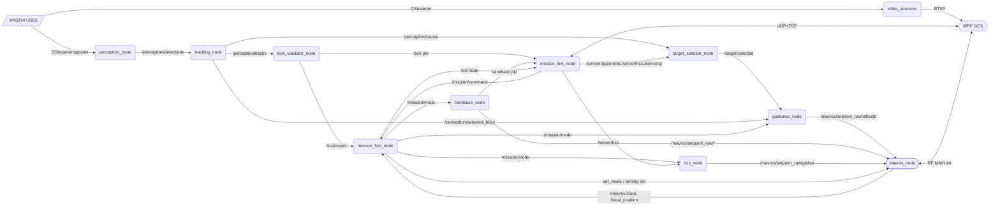
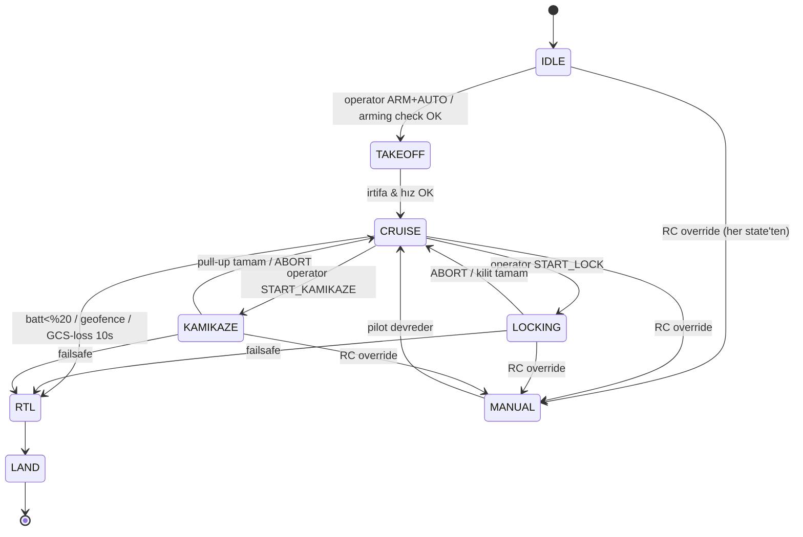
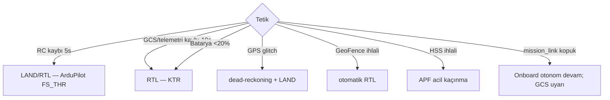
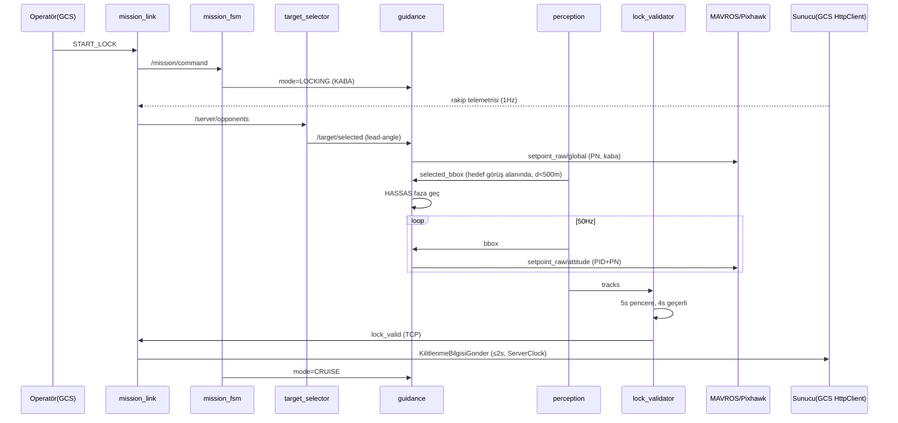

# GÖKDOĞAN — Savaşan İHA 2026 · YAZILIM MİMARİSİ (SAD v1.0)

> **Software Architecture Document.** KESİN PLAN v4'ün teknik karşılığı; nihai KTR (Takım ID 759667) ile uyumlu.
> **ROS2 Humble (container, Xavier NX) + C# WPF GCS (.NET 10).** Kapsam: SADECE YAZILIM.
> Etiket: `[R]` = KTR taahhüdü · `[Ö]` = mimari tercih (KTR'de yok)

---

## İÇİNDEKİLER
1. Mimari sürücüler, kısıtlar, ilkeler
2. Sistem bağlamı (C4-L1)
3. Konteyner mimarisi (C4-L2) + Otorite matrisi
4. Dağıtım & konteyner mimarisi (Jetson · Docker · Humble)
5. ROS2 mimarisi (node graph, lifecycle, executor, component container)
6. Topic / Service / Action envanteri + QoS matrisi
7. Özel mesaj/servis/action tanımları
8. MAVROS entegrasyonu (ENU↔NED, mode, setpoint)
9. `mission_link` protokolü (Jetson ↔ GCS sınırı)
10. Algı pipeline mimarisi
11. Güdüm & kontrol mimarisi (iki-faz cascade)
12. Görev FSM (DFA) + Kamikaze alt-FSM
13. HSS / APF mimarisi
14. GCS (WPF) mimarisi
15. Sunucu haberleşme mimarisi
16. Video & kayıt mimarisi
17. Eşzamanlılık & threading modeli
18. Failsafe & güvenlik mimarisi
19. Konfigürasyon & parametre yönetimi
20. Simülasyon mimarisi
21. Repo yapısı & build
22. Gözlemlenebilirlik (log, zaman tabanı)
23. Uçtan uca senaryolar (sekans diyagramları)
24. Modül sahiplik & arayüz sınırları
25. Açık teknik noktalar

---

## 1. MİMARİ SÜRÜCÜLER, KISITLAR, İLKELER

**Sürücüler (driver):**
- D1 — Otonom başarılı kilitlenme 500 puan: en yüksek öncelik; tüm görsel-servo döngüsü düşük gecikmeli olmalı.
- D2 — Telemetri kesintisi cezası (-0.2/sn) + ödül şartı: sunucu I/O ve otonom uçuş %100 sağlam.
- D3 — "En İyi Arayüz" ödülü: GCS profesyonel, tek ekrandan görev yönetimi.

**Kısıtlar (constraint):**
- C1 [R] — Onboard: Jetson Xavier NX, **ROS2 Humble (container)**, MAVROS köprü.
- C2 [R] — GCS: .NET 10 / C# / WPF (mevcut repo).
- C3 [R] — Sunucu I/O: GCS'te HttpClient, **tek yetkili IP**, ≤2Hz telemetri.
- C4 [R] — Kamera AR0234, 1920×1200, 82° FOV, 50fps, USB3, merkez (960,600).
- C5 — Yarışma ağı: firewall kapalı, tek IP, Wi-Fi köprü → DDS multicast keşfi **kullanılmaz**.
- C6 — Xavier NX native = Ubuntu 20.04 (L4T r35) → Humble container'da (22.04 tabanlı) çalışır.

**Mimari ilkeler (architecture principle):**
- **İ1 — Tek otorite:** Her sorumluluğun tek doğruluk kaynağı (§3). Aynı mantık iki yerdeyse canlı yolda yalnızca otorite karar verir.
- **İ2 — Kritik döngü uçakta + izole:** Algı→güdüm→MAVROS döngüsü onboard; ground/Wi-Fi bağlantısı koparsa uçuş kontrolü kopmaz.
- **İ3 — Diller arası tek ince sınır:** ROS2 (Linux) ve WPF (Windows) yalnızca `mission_link` (dil-bağımsız UDP/TCP) ile konuşur. C# ROS2 binding'i / rosbridge YOK.
- **İ4 — DDS lokal:** Tüm ROS2 trafiği Jetson içinde (`ROS_LOCALHOST_ONLY=1`); ağa sızmaz.
- **İ5 — Sim = gerçek graph:** Otonomi node'ları SITL mi gerçek Pixhawk mı bilmez (ikisi de MAVROS arkasında). Aynı kod uçar.
- **İ6 — Kontrat-önce:** `mission_link` şeması + `.msg` paketleri gün 1-2'de dondurulur; paralel geliştirme bunlara dayanır.

---

## 2. SİSTEM BAĞLAMI (C4 — Seviye 1)

```
                         ┌───────────────────────┐
        Saha pilotu ────►│   RC Kumanda (AT10II)  │──S-BUS──► [Pixhawk]
        (manuel/acil)    └───────────────────────┘
                                                              ▲ (MAVLink/RF + UART)
   ┌──────────────┐   HTTP/JSON    ┌─────────────────────────┴───────────────────────┐
   │   Yarışma    │◄──(Ethernet)──►│            GÖKDOĞAN YAZILIM SİSTEMİ               │
   │   Sunucusu   │  telemetri,    │   (Onboard ROS2 otonomi  +  WPF GCS)             │
   │ (hakem)      │  kilit, kamikaze│                                                  │
   └──────────────┘  QR, HSS, saat └───┬──────────────┬───────────────┬──────────────┘
                                       │              │               │
                              (USB3)   ▼      (CAN)   ▼      (5GHz)    ▼
                                  [AR0234 Kamera] [Here4 RTK GPS]  [Wi-Fi köprü]
                                                                  Rocket5AC↔PowerBeam5AC
```
Dış aktörler: **Yarışma sunucusu** (veri kaynağı/hedefi), **Pixhawk** (uçuş kontrol — bizim yazılım değil ama MAVLink ile konuşulur), **Kamera/GPS/RTK/Wi-Fi** (donanım), **Saha pilotu** (RC ile güvenlik).

---

## 3. KONTEYNER MİMARİSİ (C4 — Seviye 2)

İki çalışma zamanı (runtime), beş hat:

```
┌───────────────────── ONBOARD (Jetson Xavier NX · Docker · ROS2 Humble) ──────────────────────┐
│  [perception]→[tracking]→[lock_validator]   [target_selector]                                 │
│         │                       │                  │                                          │
│         │              [guidance: coarse(GPS+PN) / precise(vision+PID)]                        │
│         │              [kamikaze_fsm]  [hss_apf]  [mission_fsm]──►[MAVROS]──UART──►(Pixhawk)    │
│         │                                                  │                                   │
│  [video_streamer]──RTSP──┐                         [mission_link_node]                         │
└──────────────────────────┼──────────────────────────────┼────────────────────────────────────┘
                  ④ RTSP    │                  ③ mission_link (UDP stream + TCP control)
                  (Wi-Fi)   │                              │ (Wi-Fi)
   (Pixhawk)──① RF/MAVLink──┼──────────────────►  ┌────────┴───────────────────────────────────┐
   (RFD868x)                │                      │        WPF GCS (.NET 10 · Windows)          │
                            └─────────────────────►│  MavlinkSource + MissionLinkSource →        │
                                                   │     FlightState → ViewModels → UI           │
   (Yarışma Sunucusu)──⑤ HTTP/Ethernet────────────►│  GameServerClient · VideoPanel(LibVLC+kayıt)│
                                                   └─────────────────────────────────────────────┘
```

**Hatlar:** ① RF MAVLink (uçuş telemetrisi + operatör mod/RTL) · ② UART MAVLink (otonomi, MAVROS) · ③ `mission_link` Wi-Fi (vision↑ / rakip-HSS-QR-komut↓) · ④ RTSP Wi-Fi (kamera) · ⑤ HTTP Ethernet (sunucu).

### Otorite matrisi (tutarlılık çekirdeği)
| Sorumluluk | Otorite | Diğer taraf |
|---|---|---|
| Algı, takip, kilit denetimi, kamikaze, HSS, güdüm, hedef seçimi, FSM | **Onboard (ROS2)** | GCS gösterir |
| Pixhawk yazma (otonomi) | **Onboard** (MAVROS, mission_fsm tek yazıcı) | — |
| Sunucu I/O, telemetri ≤2Hz, ServerClock | **GCS** (C#) | Onboard paket içeriğini üretir |
| Video overlay + MP4 kayıt | **GCS** | Onboard ham RTSP yollar |
| Uçuş telemetrisi gösterimi | **GCS** (RF MAVLink) | Mission Planner (safety, ops.) |

---

## 4. DAĞITIM & KONTEYNER MİMARİSİ (Jetson · Docker · Humble)

**Temel imaj [Ö]:** `dustynv/ros:humble-*` (jetson-containers projesi — L4T üzerinde ROS2 Humble + CUDA + cuDNN + TensorRT) ya da `nvcr.io/nvidia/l4t-pytorch` üzerine Humble derlemesi. CUDA/TensorRT JetPack 5.x'ten (TensorRT 8.x).

**Çalıştırma:**
```bash
docker run -d --name gokdogan-onboard \
  --runtime nvidia --network host --restart unless-stopped \
  --device /dev/ttyTHS1 \            # Pixhawk Telem1 (UART)
  --device /dev/video0 \             # AR0234 (UVC/USB3)
  -v /opt/gokdogan/models:/models \  # TensorRT engine (.plan)
  -v /opt/gokdogan/logs:/logs \      # rosbag2 + structured log
  -e ROS_LOCALHOST_ONLY=1 \          # DDS sadece lo (İ4)
  -e RMW_IMPLEMENTATION=rmw_cyclonedds_cpp \
  gokdogan-onboard:latest \
  ros2 launch gokdogan_bringup competition.launch.py mode:=hardware
```

**Neden böyle:** `--runtime nvidia` GPU (TensorRT) · `--network host` + `ROS_LOCALHOST_ONLY=1` → DDS lokal, Wi-Fi'ye sızmaz · `--device` ile UART/kamera erişimi · model/log host volume'da (container yeniden başlasa kaybolmaz) · `--restart unless-stopped` güç kesintisinde otomatik kalkar.

**Otomatik başlatma:** Jetson host'ta `systemd` servisi (`gokdogan.service`) container'ı boot'ta `docker start` eder. Container entrypoint `ros2 launch` çağırır.

**Görüntü/derleme:** TensorRT engine (.plan) **cihaza özgü** — Jetson üzerinde `trtexec` ile ONNX'ten derlenir, `/models`'a yazılır (build makinesinde değil).

---

## 5. ROS2 MİMARİSİ

### 5.1 Node grafiği



### 5.2 Lifecycle node'lar
`mission_fsm_node` ve `mavros` köprü çevresi **managed (lifecycle) node**: `unconfigured→inactive→active→finalized`. Kalkış öncesi tüm node'lar `active` değilse `mission_fsm` `IDLE`'da kilitli kalır (arming check'e benzer yazılım kapısı).

### 5.3 Component container (kritik döngü, intra-process)
Düşük gecikme için `perception_node + tracking_node + lock_validator_node + guidance_node` **tek `ComponentContainer`** içine yüklenir; `use_intra_process_comms=true` → bbox/track/setpoint mesajları **kopyasız (zero-copy)** geçer. `mavros`, `mission_fsm`, `kamikaze`, `hss`, `mission_link`, `video_streamer` ayrı süreçler (boundary/IO node'ları).

### 5.4 Executor & callback group
Kritik container'da **MultiThreadedExecutor**:
- `cb_perception` (Reentrant) — kamera 50fps callback (YOLO/Kalman); ağır iş ayrı thread'de.
- `cb_control` (MutuallyExclusive) — 50Hz PID timer + 10Hz PN timer; asla bloklanmaz.
- `cb_io` (Reentrant) — MAVROS state/pozisyon abonelikleri.
Böylece görsel işlem kontrol döngüsünü geciktirmez.

### 5.5 DDS
RMW: **CycloneDDS**, `ROS_LOCALHOST_ONLY=1` (yalnız `lo`). XML config ile `Interfaces=lo`, multicast kapalı. Yarışma ağında keşif denenmez (İ4, C5).

---

## 6. TOPIC / SERVICE / ACTION ENVANTERİ + QoS MATRİSİ

| Topic | Tip | Yön | Hız | Reliability | History/Depth | Durability |
|---|---|---|---|---|---|---|
| `/camera/image` (intra) | sensor_msgs/Image | PCV içi | 50Hz | BEST_EFFORT | KEEP_LAST/1 | VOLATILE |
| `/perception/detections` | gokdogan/Detections | PCV→TRK | 10Hz | RELIABLE | KEEP_LAST/5 | VOLATILE |
| `/perception/tracks` | gokdogan/Tracks | TRK→* | 50Hz | BEST_EFFORT | KEEP_LAST/1 | VOLATILE |
| `/perception/selected_bbox` | gokdogan/BBox | TRK→GUI | 50Hz | BEST_EFFORT | KEEP_LAST/1 | VOLATILE |
| `/target/selected` | gokdogan/Target | TS→GUI | 2Hz | RELIABLE | KEEP_LAST/10 | TRANSIENT_LOCAL |
| `/lock/event` | gokdogan/LockEvent | LV→* | olay | RELIABLE | KEEP_LAST/20 | VOLATILE |
| `/mission/mode` | gokdogan/MissionMode | MFSM→* | olay+1Hz | RELIABLE | KEEP_LAST/10 | TRANSIENT_LOCAL |
| `/mission/command` | gokdogan/MissionCommand | ML→MFSM | olay | RELIABLE | KEEP_LAST/10 | VOLATILE |
| `/server/opponents` | gokdogan/Opponents | ML→TS,HSS | 1Hz | RELIABLE | KEEP_LAST/5 | TRANSIENT_LOCAL |
| `/server/hss` | gokdogan/HssList | ML→HSS | 0.2–1Hz | RELIABLE | KEEP_LAST/5 | TRANSIENT_LOCAL |
| `/aircraft/state` | gokdogan/AircraftState | MAV→* | 20Hz | BEST_EFFORT | KEEP_LAST/1 | VOLATILE |
| `/mavros/setpoint_raw/attitude` | mavros_msgs/AttitudeTarget | GUI→MAV | 50Hz | BEST_EFFORT | KEEP_LAST/1 | VOLATILE |

**QoS ilkesi:** Yüksek-hız/akış → `BEST_EFFORT, depth=1` (en taze kazanır). Olay/komut/durum → `RELIABLE`; mod/seçim gibi "geç-katılan abone son değeri görmeli" → `TRANSIENT_LOCAL`. **Publisher/subscriber QoS uyumsuzluğu** Humble'da sessiz bağlantı kopması yapar → her topic için QoS profili `gokdogan_qos.hpp`'de merkezî tanımlı.

---

## 7. ÖZEL MESAJ / SERVİS / ACTION TANIMLARI

`gokdogan_msgs/msg`:
```
# BBox.msg
float32 x  float32 y  float32 w  float32 h     # 1920x1200 uzayında
float32 score  int32 track_id  builtin_interfaces/Time stamp

# Track.msg  (Kalman çıktısı)
int32 id  BBox box  float32 vx  float32 vy  float32 age  bool predicted

# Tracks.msg
std_msgs/Header header  Track[] tracks  int32 selected_id

# LockEvent.msg
bool valid              # 4s pencere doldu
int32 target_id  BBox box  float32[2] center
float32 progress_s      # 0..4 (canlı ilerleme, ayna için)
builtin_interfaces/Time lock_end_time

# Target.msg  (seçilen rakip)
int32 takim_no  float64 lat  float64 lon  float32 alt
float32 lead_lat  float32 lead_lon   # tahmini kesişim
float32 score

# MissionMode.msg
uint8 state          # 0 IDLE 1 TAKEOFF 2 CRUISE 3 LOCKING 4 KAMIKAZE 5 RTL 6 LAND 7 MANUAL
uint8 active_service  # hangi node komut hakkı sahibi
string detail

# MissionCommand.msg  (GCS→onboard, operatör)
uint8 type           # START_LOCK, ABORT, SELECT_TARGET, START_KAMIKAZE, SET_MODE
int32 target_id  string mode  string params_json

# Opponents.msg / HssList.msg / AircraftState.msg → KTR alanları (enlem,boylam,irtifa,dikilme,yonelme,yatis,hiz,zaman_farki) / (id,enlem,boylam,yaricap) / (lat,lon,alt,roll,pitch,yaw,vground,vair,batt,mode,armed,is_autonomous)
```
`gokdogan_msgs/srv`: `SetMissionMode`, `ArmDisarm`. `action`: `ExecuteKamikaze` (uzun süreli, feedback=faz).

---

## 8. MAVROS ENTEGRASYONU

**Bağlantı:** `mavros_node` `fcu_url:=/dev/ttyTHS1:921600` (gerçek) / `udp://:14555@` (SITL). `tgt_system=1`.

**Abone olunan (Pixhawk→ROS):** `/mavros/state` (mode, armed, connected) · `/mavros/local_position/pose` (ENU) · `/mavros/global_position/global` (lat/lon/alt) · `/mavros/imu/data` · `/mavros/battery` · `/mavros/global_position/compass_hdg`.

**Yayınlanan setpoint'ler (ROS→Pixhawk):**
- `/mavros/setpoint_raw/attitude` (AttitudeTarget) — **görsel-servo** (roll/pitch/yaw rate + thrust), 50Hz, mode=GUIDED.
- `/mavros/setpoint_raw/global` (GlobalPositionTarget) — **kaba yaklaşım + HSS waypoint**.
- `/mavros/setpoint_velocity/cmd_vel`.

**Servisler:** `/mavros/set_mode` (GUIDED/AUTO/RTL/LOITER), `/mavros/cmd/arming`, `/mavros/mission/push` (waypoint görev), `/mavros/cmd/takeoff`, `/mavros/cmd/land`.

**⚠️ ENU↔NED — kritik tuzak:** MAVROS, ROS REP-103 **ENU** kullanır; Pixhawk **NED**. Dönüşümü MAVROS yapar ama **yaw konvansiyonu farklı**: ENU yaw = Doğu'dan CCW; NED heading = Kuzey'den CW. Güdüm setpoint'leri **ENU** üretmeli (`yaw_enu = π/2 − heading_ned`). Pozisyon: ENU (x=East, y=North, z=Up). Bu dönüşüm `guidance/frames.hpp`'de tek yerde; her yerde elle çevirme YASAK (hata kaynağı). MAVROS stream rate'leri `mavros/conf` ile artırılır (varsayılan düşük → kontrol için ATTITUDE/LOCAL_POSITION ≥50Hz iste).

**Tek yazıcı invaryantı:** Yalnız `mission_fsm`'in izin verdiği aktif servis setpoint yayınlar. Diğer node'lar yayınlarını `mission_fsm`'in `/mission/mode.active_service` değerine göre gate'ler (kendi içlerinde kontrol).

---

## 9. `mission_link` PROTOKOLÜ (Jetson ↔ GCS — diller arası tek sınır)

**Tasarım kararı:** rosbridge ve C# ROS2 binding'i **kullanılmaz** (olgunluk/karmaşıklık). Yerine dil-bağımsız **iki soket**:

- **UDP akış kanalı (5005):** yüksek-hız, kayıp-toleranslı, latest-wins. `aircraft_vision` (bbox + lock_state + fsm_state + metrics), ~15–30Hz. Her pakette `seq` + `ts` (gecikme/kayıp istatistiği). Sadece **gösterim/overlay** için (kontrol değil) → kaybı kritik değil.
- **TCP kontrol kanalı (5006):** kalıcı bağlantı, güvenilir, sıralı. **Kritik** olay/komutlar: ▲ `lock_valid`, `kamikaze_result`; ▼ `operator_cmd`, `server_data` (rakip/HSS/QR/saat), `config` (autonomy weights). 1Hz app-level heartbeat (kopma tespiti).

**Çerçeveleme:** TCP = length-prefixed (4B BE uzunluk + MessagePack gövde). UDP = tek datagram = tek MessagePack mesaj. **Şema dil-bağımsız** (MessagePack/JSON) → ne ROS ne .NET diğerini bilmez.

**Güvenilirlik & kopma davranışı:**
- TCP kopması → onboard **otonom devam eder** (İ2); GCS "mission_link kopuk" uyarısı + son bilinen durumu donuk gösterir; otomatik reconnect (exponential backoff).
- UDP timeout (>0.5s paket yok) → GCS overlay'i "stale" işaretler.
- Saat: `ts` ile tek yönlü gecikme ölçülür; ServerClock offset'i GCS→onboard `server_data` ile taşınır.

**Onboard taraf:** `mission_link_node` (rclpy) — ROS2 topic ↔ soket köprüsü. Up: ilgili topic'lere abone → seri hale getirip yolla. Down: soketten al → ilgili topic'lere publish.

**GCS taraf:** `MissionLinkClient` (C#, arka plan task) — soketten oku → `FlightState`'e yaz (vision alanları). `operator_cmd`/`config` gönder. Threading §17.

---

## 10. ALGI PIPELINE MİMARİSİ

```
AR0234(USB3,1920×1200,50fps) ─GStreamer(v4l2src!...!appsink)─► [perception_node]
   ├─ preprocess: merkez %70 ROI crop → 640×640 (letterbox)            (CUDA)
   ├─ infer: TensorRT FP16 engine (YOLOv11s) → boxes                   (GPU)
   ├─ postprocess: NMS, koordinat geri-ölçek → 1920×1200
   └─ publish /perception/detections (10Hz, YOLO her 5 karede)
[tracking_node]
   ├─ Kalman predict (her kare, 50Hz): durum [px,py,vx,vy,ax,ay]
   ├─ YOLO geldiğinde: Hungarian (Cost=1−IoU), IoU≥0.3 ID koru, <0.3 yeni ID
   ├─ selected_id = target_selector skoruyla
   └─ publish /perception/tracks (50Hz) + /perception/selected_bbox
```

**Threading:** GStreamer kendi thread'inde frame üretir → `appsink` callback → lock-free ring buffer → `cb_perception` (Reentrant) en taze frame'i alır (eski frame'leri atar, gecikme birikmez). YOLO inference ağır → ayrı CUDA stream; Kalman hafif → her karede main.

**İki GStreamer pipeline (tek kamera):** kamera tek; bir `tee` ile (a) `appsink`→inference, (b) `nvv4l2h264enc`→RTSP (video_streamer). Çakışma yok.

**Koordinat uzayları:** inference 640×640 → publish öncesi **1920×1200**'e ölçeklenir (KTR: kilit hassasiyeti orijinal uzayda). Kilit dörtgeni & sunucu paketi 1920×1200 uzayında. Merkez (960,600).

---

## 11. GÜDÜM & KONTROL MİMARİSİ (iki-faz cascade)

**İki faz [R]** (`/mission/mode == LOCKING`):
```
            d ≥ 500m  VEYA  kamerada hedef yok
                    │ KABA FAZ
   target_selector → lead-angle kesişim → /mavros/setpoint_raw/global
                    │ (PN ile rakibin tahmini konumuna, sunucu telemetrisi)
   ── d<500m && selected_bbox taze ──► HASSAS FAZ (histerezis: 480/520m)
                    │
   selected_bbox → piksel hatası → PID(50Hz) → φ_cmd,θ_cmd
   PN(10Hz) → uzun-vadeli yön → cascade setpoint → /mavros/setpoint_raw/attitude
```

**Hassas faz cascade:**
- **PN (10Hz):** `a_c = N·V_c·λ̇`, N=4 → stratejik φ_cmd, θ_cmd.
- **PID (50Hz):** piksel hatası (merkez 960,600) → ince düzeltme. Roll Kp=0.042/Ki=0.0008/Kd=0.025, φ±45°, θ±30°. Yaw↔roll couple, bağımsız PID rüzgâr/sideslip. Throttle `d=W·f/W_piksel` (W≈2m, W_piksel≈1100→~50m).
- **Rate limit + LPF:** Δφ_max=20°/s, α=0.3 → kanada zarar veren ani komut yok.

**Faz geçişi** `guidance_node` içinde state'li (histerezis + "bbox taze mi" kontrolü) → flapping yok. Geçiş anı log'lanır (test grafiği).

---

## 12. GÖREV FSM (DFA) + KAMİKAZE ALT-FSM



**Tahkim (İ1):** `mission_fsm` her state'te **tek `active_service`** belirler (CRUISE→hiç/HSS, LOCKING→guidance, KAMIKAZE→kamikaze). Setpoint yazma hakkı yalnız o serviste. `MissionMode` topic'i ile yayınlanır; servisler kendini gate'ler.

**Operatör vs otonomi:** Yüksek-seviye komut (START/ABORT/SELECT) `mission_link`→`/mission/command`→FSM. Mod/RTL/arming GCS'ten doğrudan MAVLink **veya** FSM servisi (ikisi de ArduPilot'ta geçerli). **RC override** = MANUAL (pilot her an devralır; FSM bunu `/mavros/state` mode değişiminden algılar, setpoint yazmayı bırakır).

**Kamikaze alt-FSM (action):** `Idle→Intikal(100m,Pure Pursuit)→Dalış(−45°,TECS,28/30m/s)→QR(50m↓,perspektif+dual decode)→PullUp(R=45m,2.7G,min irtifa)`. Her faz guard'ı (irtifa eşiği, QR doğrulama, max 2 deneme). Sonuç → `mission_link`→GCS POST (≤2s).

---

## 13. HSS / APF MİMARİSİ

`hss_node` (10Hz), `/server/hss` aboneliği:
- Çekici `F_att=−k_att(X−X_hedef)`, k_att 0.5–1.0; İtici `U_rep=½k_rep(1/d−1/d₀)²`, k_rep 5–20; **d₀=r_HSS+25m**.
- `F_toplam` → açı → `/mavros/setpoint_raw/global` waypoint setpoint.
- **Yerel-min:** hız<2m/s & |F|<0.5N → 100ms rastgele pertürbasyon → 3 başarısız → **Dubins** (R_min, HSS etrafından).
- HSS GET (GCS) 5s; aktivasyon duyurusunda 1Hz → `mission_link` ile taze liste.
- `mission_fsm` HSS'i her uçuş state'inde arka planda çalıştırabilir ama setpoint yazma hakkı tahkime tabi (acil kaçınmada FSM önceliği HSS'e verir).

---

## 14. GCS (WPF) MİMARİSİ — mevcut repoya oturmuş

```
GOKDOGANIHA.UI (WPF/MVVM)        GOKDOGANIHA.Core (saf .NET, UI-bağımsız)
  Views/MainWindow                  Models/FlightState  ◄── tek observable aggregate
  ViewModels/MainWindowVM ──bind──► Services/Api/GameServerClient  (HttpClient, tek IP)
  Controls/Map,PFD,Video,Sidebar    Services/Time/ServerClock
        ▲ 100ms DispatcherTimer     Services/Polling/TelemetryHzMeter (≤2Hz)
        │                           Services/Alerts + Monitors
  ┌─────┴── Kaynaklar (IFlightStateSource) ──────────────┐
  │  MavlinkFlightStateSource  (RF MAVLink → uçuş alanı)  │  [YENİ]
  │  MissionLinkSource         (UDP+TCP → vision alanı)   │  [YENİ]
  └───────────────────────────────────────────────────────┘
  KilitlenmeDenetim / KamikazeFsm (C#) → DEMOTE: ayna/display
```

**Akış:** İki kaynak `FlightState`'e yazar (uçuş + vision). `GameServerClient` `FlightState`'ten telemetri paketi kurar (bbox/flag `MissionLinkSource`'tan), ≤2Hz POST. `lock_valid` (TCP) → `KilitlenmeBilgisiGonder`; `kamikaze_result` → `KamikazeBilgisiGonder`; QR/HSS GET → `MissionLinkClient` ile onboard'a relay. ViewModel'in **mevcut 100ms tick'i** `FlightState`'i okuyup binding'leri günceller (repo deseni korunur).

**Komut:** Sidebar butonları → `MissionCommand` → `MissionLinkClient` (TCP) → onboard FSM. Mod/RTL → MAVLink (doğrudan) veya FSM.

---

## 15. SUNUCU HABERLEŞME MİMARİSİ

`GameServerClient` (C#, HttpClient) — KTR 6.4:
- **ServerClock:** 1Hz `/api/sunucusaati`, midpoint round-trip (`offset = t_server − (t_send+t_recv)/2`), monotonik offset. Tüm zaman damgaları bu saatten.
- **Telemetri governor:** `TelemetryHzMeter` 5s kayan pencere → **≤2Hz** zorlar (>2Hz = 400/hata 3). Paket `FlightState`'ten: `iha_*` + `hedef_merkez_X/Y/genislik/yukseklik` (MissionLinkSource'tan bbox) + `iha_kilitlenme`/`iha_otonom` flag.
- **Aralık doğrulama (gönderim öncesi):** dikilme[-90,90], yonelme[0,360], yatis[-90,90] → aralık-dışı paketi **clamp/iptal** (tüm paket reddini önle, -0.2/sn yok).
- **Kilit/kamikaze POST:** onboard olayı tetikler, ServerClock damgalar, ≤2s.
- **Relay:** rakip (1Hz) / HSS (5s→1Hz) / QR GET → `MissionLinkClient`→onboard.
- **Hata/retry:** 401→login; 5xx→backoff retry; tek yetkili IP; firewall kapalı.

---

## 16. VİDEO & KAYIT MİMARİSİ (KTR 6.5/6.6 — overlay+kayıt GCS'te)

**Onboard:** `video_streamer` GStreamer: `tee`→`nvv4l2h264enc`→RTSP (ham kamera, overlay YOK).
**GCS:** `VideoPanel` LibVLCSharp RTSP oynat → **overlay çiz** (#FF0000 dörtgen [bbox `MissionLinkSource`'tan] + sağ-üst sunucu saati [ServerClock]) → **H.264 MP4 kaydet** (kamera akışı + bu iki overlay; tüm ekran DEĞİL).
**Senkron:** bbox `mission_link` UDP'den gelir (RTSP frame'inden ~ms ayrı). Kilit dörtgeni doğru frame'e düşsün diye bbox'a `ts` damgası, RTSP frame `pts`'iyle eşleştirilir (en yakın). *(Frame-senkron testte sorun olursa **yedek:** overlay'i onboard'da bake et — KTR'den sapma, sadece gerekirse.)*
**Çıktı:** isim `[No]_[Takım]_[gg_aa_yyyy].mp4`, sabit ≥15FPS, OpenCV4.5+FFPLAY uyumlu, maç sonrası ≤10dk FTP.

---

## 17. EŞZAMANLILIK & THREADING MODELİ

| Bileşen | Model |
|---|---|
| Onboard kritik container | MultiThreadedExecutor; cb_perception (Reentrant), cb_control (MutuallyExclusive timer 50/10Hz), cb_io |
| GStreamer | Kendi thread'i; appsink→ring buffer (latest-wins) |
| mavros | Kendi süreci/executor'ı |
| mission_link_node | rclpy executor + 2 soket thread (UDP recv, TCP recv) |
| GCS MissionLinkClient | Arka plan `Task` (UDP+TCP); FlightState'e yazım → yüksek-hız veriyi thread-safe buffer'a, ViewModel 100ms tick okur; **kritik olay** (lock_valid) → `Dispatcher.Invoke` |
| GCS GameServerClient | `async/await` HttpClient; `PeriodicTimer` 2Hz |
| GCS UI | Dispatcher thread; tüm binding güncellemesi 100ms tick |

**Kural:** WPF binding yalnız UI thread'den → yüksek-hız veri arka planda biriktirilir, tick'te okunur; nadir kritik olaylar Dispatcher ile marshal edilir.

---

## 18. FAILSAFE & GÜVENLİK MİMARİSİ



**Katmanlar:** (1) **ArduPilot native failsafe** (RC/batt/GPS/geofence) — en güvenilir, parametrelerle. (2) **mission_fsm** degraded state yönetimi (RTL/LAND'e geçiş). (3) **Watchdog:** her node heartbeat; `mission_fsm` bir node ölürse güvenli state'e geçer. (4) **RC override** her zaman üstün (saha pilotu). **mission_link/Wi-Fi kopması uçuşu durdurmaz** (İ2) — kontrol onboard.

---

## 19. KONFİGÜRASYON & PARAMETRE YÖNETİMİ

- **ROS2 params (YAML):** `config/{sitl,hardware}.yaml` — PID kazançları, PN N, APF k/d₀, kamera/ROI, MAVROS url/baud, eşikler. `ros2 launch ... mode:=sitl|hardware` ile yüklenir.
- **C# settings:** `%AppData%\GOKDOGAN\settings.json` (takım no, sunucu IP, eşikler, RTSP url) — DPAPI ile şifre.
- **Autonomy weights akışı:** C# `AutonomyOptions` (0.4/0.3/0.2/0.1) → `MissionLinkClient` `config` → onboard `target_selector` parametresi. Tek doğruluk kaynağı GCS ayarı; onboard runtime'da alır.

---

## 20. SİMÜLASYON MİMARİSİ

```
[ArduPilot SITL] ◄─MAVLink(udp)─► [mavros] ◄─► AYNI ROS2 graph (otonomi node'ları değişmez, İ5)
[Gazebo Classic 11* / Gazebo Sim] ── sanal kamera (Baylands + sanal rakip + QR) ─► perception
[mock_server] ── yarışma API emülatörü ─► GCS GameServerClient (donanımsız test)
[scenario_runner] ── YAML: rakip sayısı/davranış, HSS yerleşim+aktivasyon, QR, rüzgâr
```
*Humble ile Gazebo: `gz` (Harmonic/Garden) + `ros_gz` köprüsü önerilir; Gazebo Classic 11 da `gazebo_ros_pkgs` ile Humble'da çalışır. ArduPilot `ardupilot_gazebo` plugin (ROS gerektirmez) fiziği+kamerayı sağlar.*

**İki görüntü-yolu:** (a) Gazebo sanal kamera→perception (tam döngü), (b) kayıtlı/sentetik video→perception (hızlı iterasyon). Otonomi node'ları SITL/gerçek ayrımını **bilmez** (MAVROS arkasında) → aynı kod sahaya çıkar.

---

## 21. REPO YAPISI & BUILD

```
gokdogan-onboard/                          [colcon workspace, ROS2 Humble]
  src/gokdogan_msgs/                        # .msg/.srv/.action (KONTRAT, dondur)
  src/gokdogan_perception/  (C++/Python)
  src/gokdogan_guidance/
  src/gokdogan_target_selector/
  src/gokdogan_kamikaze/
  src/gokdogan_hss/
  src/gokdogan_mission_fsm/
  src/gokdogan_mission_link/  (rclpy)
  src/gokdogan_bringup/       # launch + config/{sitl,hardware}.yaml + QoS
  sim/  (SITL, gazebo world Baylands, scenario_runner, mock_server)
  docker/  (Dockerfile.jetson-humble, compose, systemd unit)
  → colcon build --packages-up-to gokdogan_bringup

TEKNOFEST-GOKDOGAN/  (mevcut C# repo)
  + GOKDOGANIHA.Core/Services/Mavlink/MavlinkFlightStateSource.cs   [YENİ]
  + GOKDOGANIHA.Core/Services/MissionLink/MissionLinkClient.cs      [YENİ]
  + recorder (MP4+FTP), persistence, AlertToastHost, hedef aday paneli

contracts/  (mission_link MessagePack şeması — iki repoca referans, dondur)
```

---

## 22. GÖZLEMLENEBİLİRLİK

- **rosbag2** tüm topic'leri kaydeder (`/logs`) → test grafiği + post-mortem.
- **Yapısal log** (JSON, faz/state geçişleri, faz-geçiş anları, latency).
- **Tek zaman tabanı:** ServerClock = otorite (yarışma). ROS time ↔ system time ↔ server time offset'i loglanır; tüm dış paketler ServerClock damgalı.
- **mission_link metrikleri:** seq kayıp %, tek-yön gecikme → GCS Sistem Sağlığı panelinde.

---

## 23. UÇTAN UCA SENARYOLAR (sekans)

### 23.1 Otonom kilitlenme


### 23.2 Kamikaze (özet)
START_KAMIKAZE → FSM KAMIKAZE → QR koord GET(GCS)→ML→kamikaze_node → climb 100m/Pure Pursuit → dive −45°/TECS → QR(50m↓)/perspektif+dual decode → kamikaze_result→ML→GCS POST(≤2s) → pull-up(2.7G) → CRUISE.

### 23.3 Telemetri döngüsü (2Hz)
Pixhawk→RF→GCS MavlinkSource→FlightState; bbox/flag←MissionLinkSource; GameServerClient (governor ≤2Hz, aralık doğrulama, ServerClock) →POST→ rakip listesi← →ML→onboard.

### 23.4 HSS aktivasyonu
Sunucu duyuru → GCS polling 5s→1Hz → hss listesi → ML → /server/hss → hss_node APF replan → setpoint_raw/global.

### 23.5 Link kaybı
mission_link TCP kopar → onboard otonom devam (kontrol onboard) + GCS "kopuk" uyarı + reconnect; RF telemetri kopar 10s → ArduPilot/ FSM RTL.

---

## 24. MODÜL SAHİPLİK & ARAYÜZ SINIRLARI

| Modül | Sahip | Arayüz (donmuş) |
|---|---|---|
| gokdogan_msgs + mission_link şeması | **Sen** | tüm taraflar buna yazar |
| perception + tracking + lock_validator | **Emircan** | `/perception/*`, `/lock/event` |
| guidance + target_selector | **Kenan/Sen** | `/target/selected`, MAVROS setpoint |
| kamikaze + hss + mission_fsm + mission_link_node + bringup | **Sen** | `/mission/*` |
| sim + SITL + Gazebo + scenario_runner + ArduPilot param | **Kenan** | MAVROS (SITL=gerçek) |
| WPF GCS (2 kaynak, GameServerClient, video, UI) | **Hüseyin** | mission_link client + FlightState |

**Paralel çalışma:** `gokdogan_msgs` + `mission_link` şeması gün 1-2 dondurulunca herkes stub'a karşı geliştirir; Emircan kayıtlı videoda, Hüseyin mock mission_link akışında, Kenan SITL'de — kimse beklemez.

---

## 25. AÇIK TEKNİK NOKTALAR

1. Gazebo: Classic 11 (KTR) mı, `gz`+`ros_gz` (Humble-doğal) mı? — Kenan SITL kurarken netleştirir; ikisi de ArduPilot plugin ile çalışır.
2. mission_link UDP fast-path bbox gerçekten gerekiyor mu, yoksa TCP 15Hz yeter mi? — entegrasyon testinde ölç.
3. Video overlay senkronu (bbox↔RTSP frame): GCS-side yeterli mi, yoksa onboard-bake yedeği mi? — §16, testte karar.
4. perception dili: C++ (düşük gecikme) mi Python (hız) mı? — TensorRT inference C++ önerilir; tracking Python olabilir.

> Bu doküman + KESİN PLAN v4 = inşaya başlamak için yeterli. Sıradaki adım: `gokdogan_msgs` + `mission_link` şemasını yazıp dondurmak, sonra Humble container imajı + MAVROS bringup + SITL ile boş graph'ı uçtan uca çalıştırmak.
